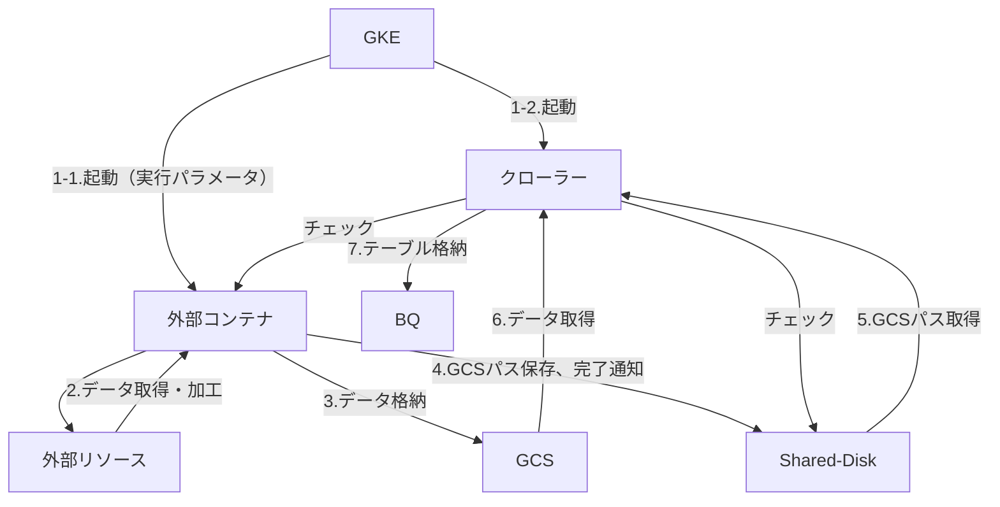

# (WIP) Collectro external container developer guide

# Khái quát

Tài liệu này là tài liệu mô tả: sử dụng và gọi 「外部コンテナ実行クローラー」(crawler thực thi container) của Collectro、các yêu cầu cần thiết cho container thực thi logic riêng biệt và mô tả về rule phát triển

- các thuận lợi của việc sử dụng chức năng này
    - 「定期実行」「バックフィル」「BQ入力」「ログ出力」などの処理をCollectroが担うことで、お客様が独自で開発するよりも開発工数の削減が期待できます。
    - 「実行スケジュール」「実行結果確認」「ログ」が Collectro の他のクローラーと同じ場所で確認でき、運用のためのツールを一元化できます。

# 用語

- クローラー： Collectro で管理されたデータの収集とBigQueryへのデータ格納の機能を持つアプリケーション。収集するデータや目的に応じたクローラーが用意されている。コンテナ技術を使用し、GKE上で動作する。
本書では、特別な記載がない限り、個別ロジック実行用のクローラーを単に「クローラー」と表記する。
- 外部コンテナ：個別ロジックを実装したコンテナイメージのこと。ワークフロー設定の設定値をもとにクローラーと同時に起動され、個別ロジックを実行する。
処理結果を BigQuery に格納するために、クローラーが受け取れる形に加工し、GCSに格納する。

# cấu trúc

## basic flow



## vai trò

- GKE：pull image của external container và crawler, khởi động mỗi container dựa trên warkflow setting đã đăng ký
- crawler： thực hiện như dưới đây
    - check external container alive or not、nếu không có hồi đáp thì tiến hành xử lý dừng lại
    - check shared disk với external container、tiến hành xử lý sau ứng với file đã được output
        - xác định kết thúc external container (job_result.txt)
            - “success”: xử lý external container xem như là đã kết thúc bình thường. Get JSON file từ path đã ghi ở GCS path file、đăng key1 lên BQ
                - schema của BQ table thì get từ workflow setting
            - “failure”: xử lý external container xem như là kết thúc không bình thường. Cho dù có GCS path file thì cũng không tiến hành đăng ký lên BQ
        - xuất log(log.txt)：làm thành log thực thi ở mỗi 1 dòng, xuất ra Web UI để có thể xác nhận
- external container：tưởng định thực thi bên dưới
    - access đến resource, tiến hành xử lý theo logic riêng biệt
        - trường hợp có credential mà cần thiết cho access resource thì get・quản lý thích hợp
    - xuất ra log (log.txt)  để có thể thấy tiến trình của xử lý
        - trường hợp phát hiện không bình thường thì xuất thông tin cần thiết cho điều tra
    - data lưu trữ ở BQ table thì đối ứng convert qua JSON format, lưu vào GCS
    - sau khi toàn bộ xử lý kết thúc 、lưu file mà đã ghi path của GCS dủa toàn bộ data  (loadpath.txt) vào shared folder
    - lưu file để thông báo cho crawler về kết thúc xử lý (job_result.txt) vào shared folder
        - trường hợp đã kết thúc toàn bộ bình thường thì xuất là ”success”
        - ngoài ra thì xuất thành “failure”
            
            ※ 件数が0件の場合を正常終了とするか否かは実行するロジックの性質に応じてご判断ください。
            

## interface

nội dung input・output của external container thì như sau

- input：
    - parameter thực thi khi khởi động external container. Được truyền thành augument của application
        - setting ở Web UI của Collectro 
    - biến môi trường：アプリケーションは環境変数として読み込み、処理に利用することができます。
        - FROM, TO: ngày đã chỉ định(format：YYYY-MM-DD)。
            1. khi 定期実行しない(adhoc) thì chèn ngày đã chỉ định
                
                e.g.) từ 2024年9月2日 đến 8日
                　→ FROM=2024-09-02, TO=2024-09-08
                
            2. 定期実行の場合は、FROM, TO 共に同じ値が入ります。
                
                e.g.) 2024年9月25日に「1日前」で実行
                
                　→ FROM=2024-09-24, TO=2024-09-24
                
            
            ※ 「毎月」で実行する場合、日付は1日になります。
            
- 出力：共有フォルダにファイルを出力することでクローラーへ情報を伝達します。
    - job_result.txt：処理の終了をクローラーに通知します。
        - “success”: 正常終了
        - “failure”: 正常終了以外
    - log.txt：1行ごとに実行ログとしてWeb UIで確認できるように出力してください。
        
        例）
        
        ```json
        {"severity":"info", "log":"メッセージ"} 
        {"severity":"error", "log":"エラーメッセージ"}
        ```
        
        - severity: “error” は slack 通知対象。
    - loadpath.txt: BQテーブルに取り込むためのGCSに格納されたJSONファイルのリスト。
        
        ```bash
        {"gcsPaths": [
        	"gcs://xxxx",
        	"gcs://yyyy"
        	]
        }
        ```
        

# pre-test

Trước khi setting ở crawler、ở external container tiến hành các test sau

1. setting các tham số cần thiết rồi khởi động container、kết thúc
    1. tham số khởi động container
    2. biến môi trường
        1. FROM, TO: ngày, kỳ hạn chỉ định
2. khi kết thúc bình thường thì nội dung sau được xuất ra
    1. job_result.txt: “success”
    2. loadpath.txt: 
        1. 取得したデータを格納したGCSファイルのパスが既定のフォーマットで出力されていること。
        2. 全てのパスにJSONファイルが想定しているBQスキーマと一致したフォーマットで格納されていること。
    3. log.txt: 適切なタイミングで処理状況を示すログが既定のフォーマットで出力されていること。
3. khi kết thúc không bình thường thì nội dung sau được xuất ra
    1. job_result.txt: “failure”
    2. log.txt: 
        1. 適切なタイミングで処理状況を示すログが既定のフォーマットで出力されていること。
        2. xuất ra log để biết được nguyên nhân , chỗ xử lý bị lỗi
        3. log của lỗi thì xuất ở "severity":"error" 
