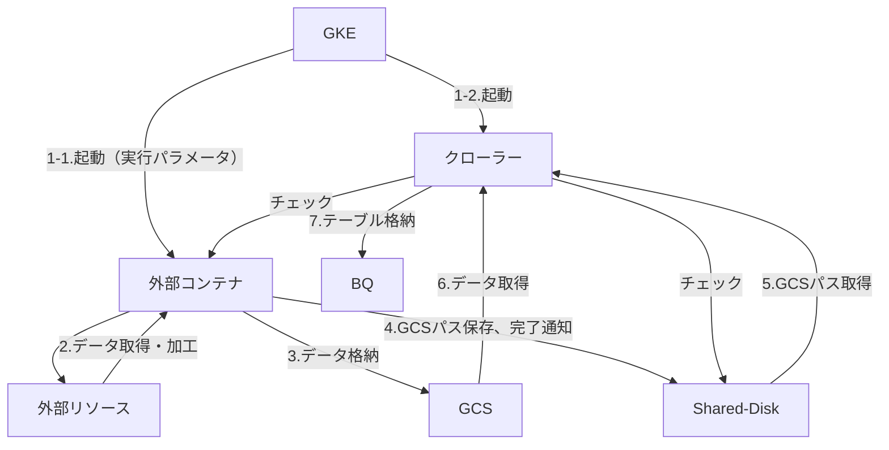

# (WIP) Collectro external container developer guide

# Khái quát

Tài liệu này là tài liệu mô tả: sử dụng và gọi 「外部コンテナ実行クローラー」(crawler thực thi container) của Collectro、các yêu cầu cần thiết cho container thực thi logic riêng biệt và mô tả về rule phát triển

- các thuận lợi của việc sử dụng chức năng này
    - xử lý chẳng hạn 「定期実行」( thực thi định kỳ), 「バックフィル」(backfill),「BQ入力」(input BQ),「ログ出力」( xuất log) thì Collectro handle customer có thể trông đợi giảm công số dev so với việc customer tự phát triển
    - 「実行スケジュール」(schedule thực thi),「実行結果確認」(xác nhận kết quả thực thi), 「ログ」(log) thì có thể xác nhận ở cùng chỗ với crawler khác của Collectro、có thể tậo trung hoác tool để vận dụng

# Thuật ngữ

- crawler： là application mà tập hợp data được quản lý bởi Collectro và nắm giữ các chức năng lưu trữ data vào BigQuery. Data tập hợp và crawler ứng với mục đích đang được chuẩn bị. Sử dụng container technology và chạy trên GKE
Trong tài liệu này, trừ khi có mô tả đặc biệt , để đơn giản khi đề cập đến crawler dùng để thực thi logic cá biệt thì sẽ gọi là 「crawler」
- external container：là container image mà thực thi logic individual(cá biệt). Được khởi động đồng thời với crawler dựa trên giá trị setting của workflow setting 、thực thi logic riêng biệt
  Để  lưu kết quả xử lý lên BigQuery thì convert sang format mà crawler có thể nhận được rồi lưu lên GCS

# cấu trúc

## basic flow



## vai trò

- GKE：pull image của external container và crawler, khởi động mỗi container dựa trên warkflow setting đã đăng ký
- crawler： thực hiện như dưới đây
    - check external container alive or not、nếu không có hồi đáp thì tiến hành xử lý dừng lại
    - check shared disk với external container、tiến hành xử lý sau ứng với file đã được output
        - xác định kết thúc external container (job_result.txt)
            - “success”: xử lý external container xem như là đã kết thúc bình thường. Get JSON file từ path đã ghi ở GCS path file、đăng key1 lên BQ
                - schema của BQ table thì get từ workflow setting
            - “failure”: xử lý external container xem như là kết thúc không bình thường. Cho dù có GCS path file thì cũng không tiến hành đăng ký lên BQ
        - xuất log(log.txt)：làm thành log thực thi ở mỗi 1 dòng, xuất ra Web UI để có thể xác nhận
- external container：tưởng định thực thi bên dưới
    - access đến resource, tiến hành xử lý theo logic riêng biệt
        - trường hợp có credential mà cần thiết cho access resource thì get・quản lý thích hợp
    - xuất ra log (log.txt)  để có thể thấy tiến trình của xử lý
        - trường hợp phát hiện không bình thường thì xuất thông tin cần thiết cho điều tra
    - data lưu trữ ở BQ table thì đối ứng convert qua JSON format, lưu vào GCS
    - sau khi toàn bộ xử lý kết thúc 、lưu file mà đã ghi path của GCS dủa toàn bộ data  (loadpath.txt) vào shared folder
    - lưu file để thông báo cho crawler về kết thúc xử lý (job_result.txt) vào shared folder
        - trường hợp đã kết thúc toàn bộ bình thường thì xuất là ”success”
        - ngoài ra thì xuất thành “failure”
            
            ※ trường hợp số record là 0 có xem xét kết thúc bình thường hay không, thì hãy xem xét ứng với bản chất logic thực thi
            

## interface

nội dung input・output của external container thì như sau

- input：
    - parameter thực thi khi khởi động external container. Được truyền thành augument của application
        - setting ở Web UI của Collectro 
    - biến môi trường：application thì đọc thành biến môi trường、có thể sử dụng ở xừ lý
        - FROM, TO: ngày đã chỉ định(format：YYYY-MM-DD)。
            1. khi 定期実行しない(adhoc) thì chèn ngày đã chỉ định
                
                e.g.) từ 2024年9月2日 đến 8日
                　→ FROM=2024-09-02, TO=2024-09-08
                
            2. trường hợp 定期実行(thực thi định kỳ) thì cả FROM, TO đều chèn giá trị giống nhau
                
                e.g.) thực thi ở「1日前」( 1 ngày trước ) vào ngày 2024年9月25日
                
                　→ FROM=2024-09-24, TO=2024-09-24
                
            
            ※ trường hợp thực thi ở 「毎月」(daily) thì ngày sẽ trở thành 1 ngày
            
- 出力(output)：bằng cách xuất file đến shared folder, thì truyển thông tin đến crawler
    - job_result.txt：thông báo kết thúc xử lý đến crawler
        - “success”: 正常終了 kết thúc bình thường
        - “failure”: 正常終了以外 ngoài kết thúc bình thường
    - log.txt：làm thành log thực thi ở mỗi dòng, xuất ra ở Web UI để có thể xác nhận
        
        ex）
        
        ```json
        {"severity":"info", "log":"メッセージ"} 
        {"severity":"error", "log":"エラーメッセージ"}
        ```
        
        - severity: “error” là đối tượng slack notification
    - loadpath.txt: list file JSON đã được lưu lên GCS để import vào BQ table
        
        ```bash
        {"gcsPaths": [
        	"gcs://xxxx",
        	"gcs://yyyy"
        	]
        }
        ```
        

# pre-test

Trước khi setting ở crawler、ở external container tiến hành các test sau

1. setting các tham số cần thiết rồi khởi động container、kết thúc
    1. tham số khởi động container
    2. biến môi trường
        1. FROM, TO: ngày, kỳ hạn chỉ định
2. khi kết thúc bình thường thì nội dung sau được xuất ra
    1. job_result.txt: “success”
    2. loadpath.txt: 
        1. GCS file path mà đã lưu data đã get thì đang được output ở format mặc định
        2. Các file JSON ở mọi path đều được lưu trữ theo format match với schema mong đợi
    3. log.txt: log biểu thị trạng thái xử lý đang dc xuất ra theo format mặc định ở thời điểm thích hợp
3. khi kết thúc không bình thường thì nội dung sau được xuất ra
    1. job_result.txt: “failure”
    2. log.txt: 
        1. log biểu thị trạng thái xử lý đang dc xuất ra theo format mặc định ở thời điểm thích hợp
        2. xuất ra log để biết được nguyên nhân , chỗ xử lý bị lỗi
        3. log của lỗi thì xuất ở "severity":"error" 
