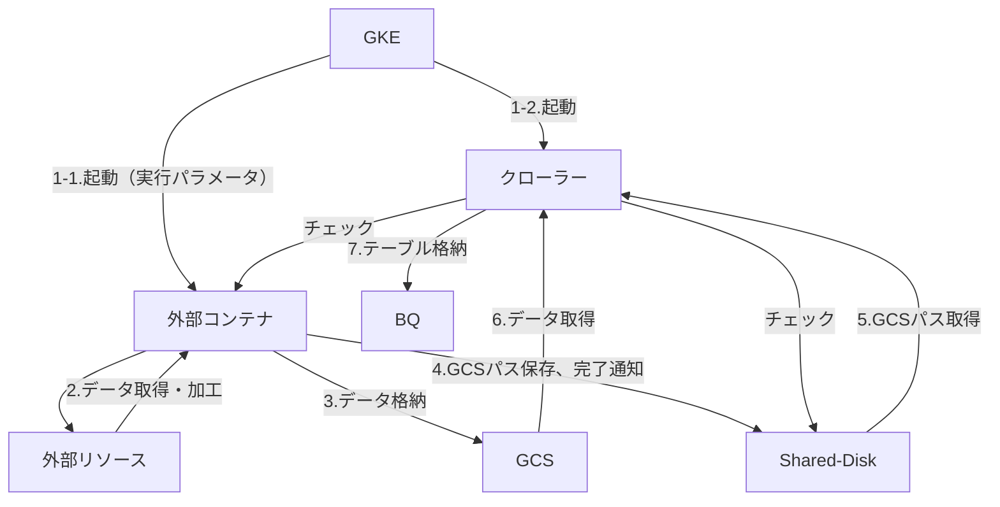

# (WIP) Collectro 外部コンテナ 開発者ガイド

# 概要

本書は、Collectro の「外部コンテナ実行クローラー」を使用して呼び出す、個別ロジックを実装するコンテナに必要な要件や、開発ルールについて記載するものです。

- 本機能を使用することのメリット
    - 「定期実行」「バックフィル」「BQ入力」「ログ出力」などの処理をCollectroが担うことで、お客様が独自で開発するよりも開発工数の削減が期待できます。
    - 「実行スケジュール」「実行結果確認」「ログ」が Collectro の他のクローラーと同じ場所で確認でき、運用のためのツールを一元化できます。

# 用語

- クローラー： Collectro で管理されたデータの収集とBigQueryへのデータ格納の機能を持つアプリケーション。収集するデータや目的に応じたクローラーが用意されている。コンテナ技術を使用し、GKE上で動作する。
本書では、特別な記載がない限り、個別ロジック実行用のクローラーを単に「クローラー」と表記する。
- 外部コンテナ：個別ロジックを実装したコンテナイメージのこと。ワークフロー設定の設定値をもとにクローラーと同時に起動され、個別ロジックを実行する。
処理結果を BigQuery に格納するために、クローラーが受け取れる形に加工し、GCSに格納する。

# 構成

## 全体の流れ



## 役割

- GKE：クローラーと外部コンテナのイメージを pull し、登録したワークフロー設定をもとに各コンテナを起動します。
- クローラー：以下を実行します。
    - 外部コンテナの生死チェック、応答がない場合に停止処理を行います。
    - 外部コンテナとの共有ディスクをチェックし、出力されたファイルに応じて以下の処理を行います。
        - 外部コンテナの終了判定 (job_result.txt)
            - “success”: 外部コンテナの処理が正常に終了したとして判定。GCSパスファイルに記載のパスからJSONファイルを取得し、BQに登録します。
                - BQテーブルのスキーマはワークフロー設定から取得します。
            - “failure”: 外部コンテナの処理が異常終了として判定。GCSパスファイルがあってもBQへの登録は行いません。
        - ログ出力(log.txt)：1行ごとに実行ログとしてWeb UIで確認できるように出力します。
- 外部コンテナ：以下を実行することを想定。
    - リソースにアクセスして個別ロジックで処理を実行します。
        - リソースアクセスに必要なクレデンシャルがある場合、適切に取得・管理します。
    - 処理の経過がわかるようにログ (log.txt) を出力します。
        - 異常を検知した場合、調査に必要な情報を出力します。
    - BQテーブルに格納するデータをJSONフォーマットに加工し、GCSに格納します。
    - 処理が全て完了したのちに、全てのデータのGCSのパス記載したファイル (loadpath.txt) を共有フォルダに格納します。
    - 処理の終了をクローラーに通知するためのファイル (job_result.txt) を共有フォルダに格納します。
        - 全て正常に完了した場合、”success” と出力します。
        - それ以外は “failure” と出力します。
            
            ※ 件数が0件の場合を正常終了とするか否かは実行するロジックの性質に応じてご判断ください。
            

## インターフェース

外部コンテナの入力・出力の内容は以下の通りです。

- 入力：
    - 外部コンテナ起動時の実行パラメータ。アプリケーションの引数として渡されます。
        - Collectro の Web UI で設定します。
    - 環境変数：アプリケーションは環境変数として読み込み、処理に利用することができます。
        - FROM, TO: 指定した日付(フォーマット：YYYY-MM-DD)。
            1. 定期実行しない、追加実行の時に指定した日付が入ります。
                
                e.g.) 2024年9月2日から8日まで
                　→ FROM=2024-09-02, TO=2024-09-08
                
            2. 定期実行の場合は、FROM, TO 共に同じ値が入ります。
                
                e.g.) 2024年9月25日に「1日前」で実行
                
                　→ FROM=2024-09-24, TO=2024-09-24
                
            
            ※ 「毎月」で実行する場合、日付は1日になります。
            
- 出力：共有フォルダにファイルを出力することでクローラーへ情報を伝達します。
    - job_result.txt：処理の終了をクローラーに通知します。
        - “success”: 正常終了
        - “failure”: 正常終了以外
    - log.txt：1行ごとに実行ログとしてWeb UIで確認できるように出力してください。
        
        例）
        
        ```json
        {"severity":"info", "log":"メッセージ"} 
        {"severity":"error", "log":"エラーメッセージ"}
        ```
        
        - severity: “error” は slack 通知対象。
    - loadpath.txt: BQテーブルに取り込むためのGCSに格納されたJSONファイルのリスト。
        
        ```bash
        {"gcsPaths": [
        	"gcs://xxxx",
        	"gcs://yyyy"
        	]
        }
        ```
        

# 事前テスト

クローラーで設定する前に、外部コンテナでは以下のテストを行うこと。

1. 必要なパラメータを設定してコンテナを起動し、終了すること。
    1. コンテナ起動パラメータ
    2. 環境変数
        1. FROM, TO: 指定日付、期間
2. 正常終了時には以下の内容が出力されること。
    1. job_result.txt: “success”
    2. loadpath.txt: 
        1. 取得したデータを格納したGCSファイルのパスが既定のフォーマットで出力されていること。
        2. 全てのパスにJSONファイルが想定しているBQスキーマと一致したフォーマットで格納されていること。
    3. log.txt: 適切なタイミングで処理状況を示すログが既定のフォーマットで出力されていること。
3. 異常終了時には以下の内容が出力されること。
    1. job_result.txt: “failure”
    2. log.txt: 
        1. 適切なタイミングで処理状況を示すログが既定のフォーマットで出力されていること。
        2. エラーになった処理の場所、原因がわかるログを出力すること。
        3. エラーのログは "severity":"error" で出力すること。